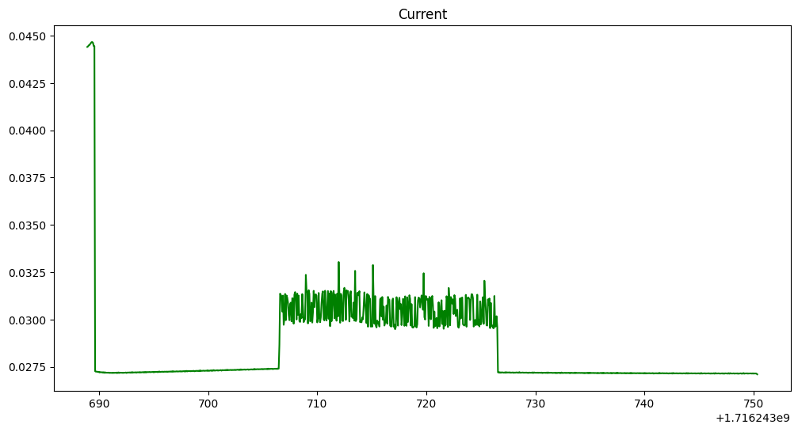
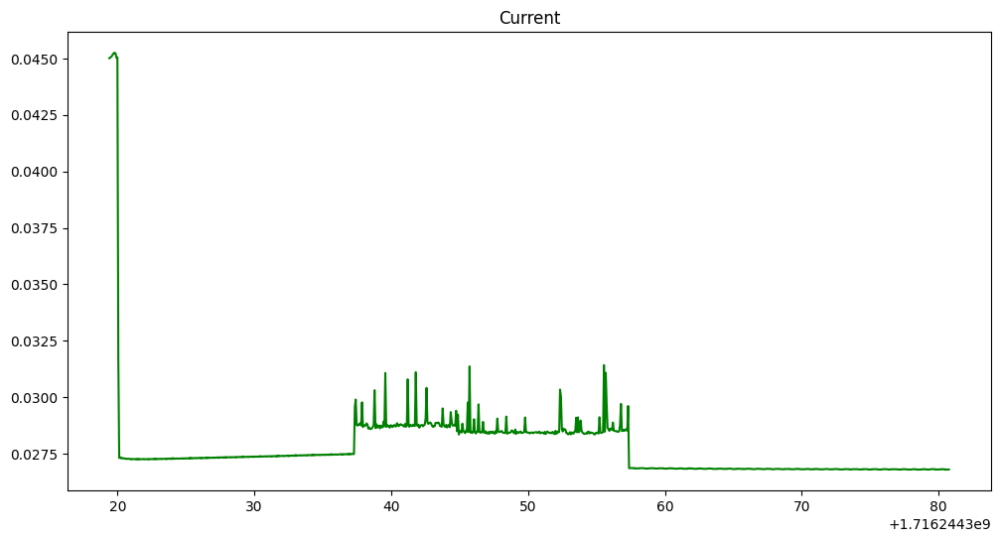
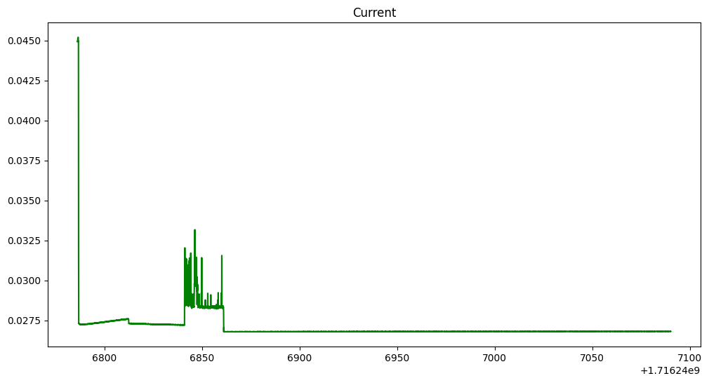
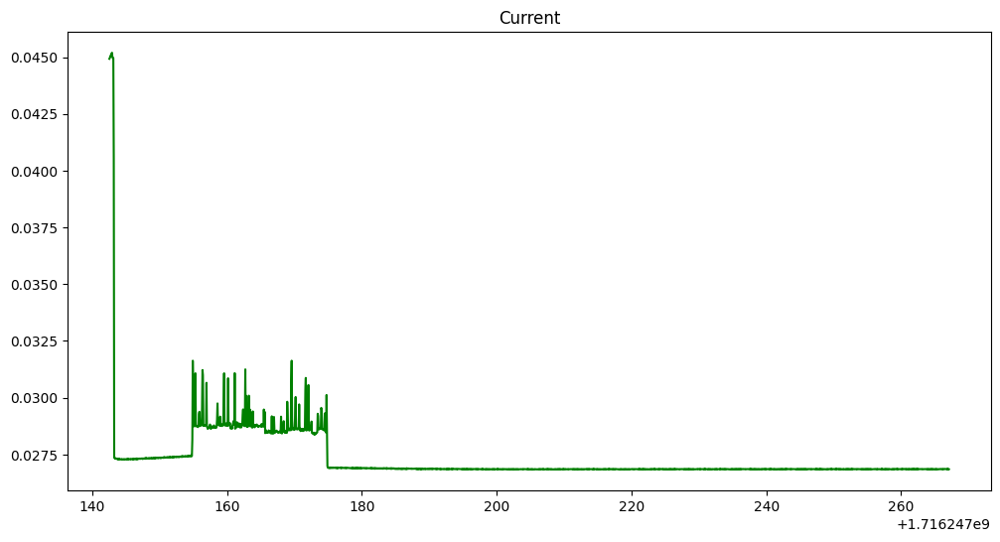
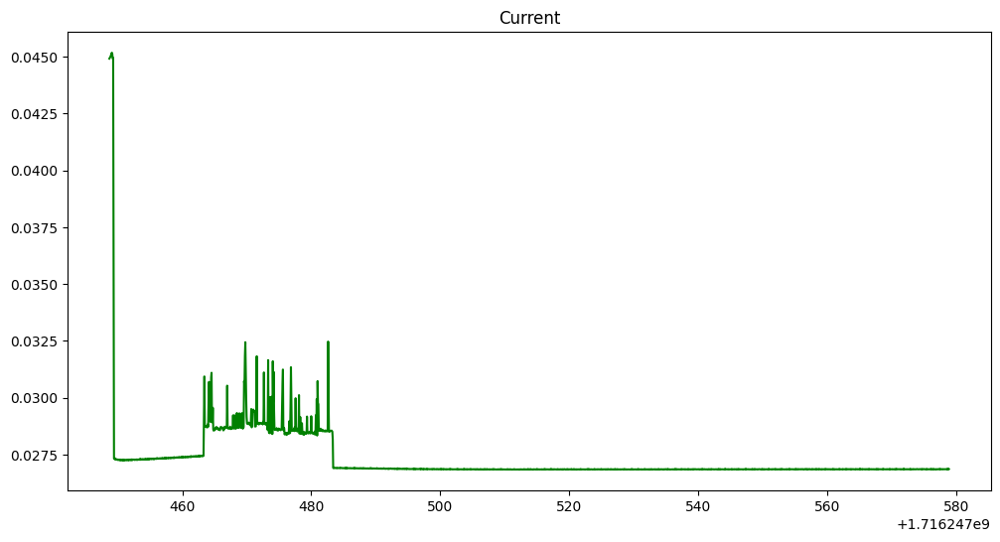

# Individual Assignment, IoT 2024
Pedro Moreira - 2162606

## Introduction

This project aims to create an IoT system that collects sensor data, processes it locally, and communicates aggregated values to a nearby server. The system adapts its sampling frequency to save energy and reduce communication overhead. The IoT device is based on an ESP32 prototype board, and the firmware is developed using FreeRTOS. The implementation is done using IoT-LAB.

### Objectives

1. **Signal Generation**: Generate an input signal as a sum of sinusoidal functions.
2. **Maximum Sampling Frequency**: Identify the maximum sampling frequency of the ESP32 hardware.
3. **Optimal Sampling Frequency**: Compute the FFT to determine the dominant frequency and adjust the sampling frequency accordingly.
4. **Aggregate Function**: Compute the average value of the sampled signal over a specified window.
5. **Secure Communication**: Transmit the aggregate value securely to a nearby server using MQTT.
6. **Performance Evaluation**: Measure energy savings, communication overhead, and end-to-end latency.

This project demonstrates an efficient and adaptive IoT system capable of real-time data processing and communication.


## Signal Generation

In this project, signal generation is performed using a Python script that sends a sinusoidal signal to an IoT device via TCP. The signal is generated as a sum of sinusoidal functions. Below is an explanation of the key components and decisions behind the implementation, along with relevant code snippets.

### Authentication

First, we authenticate to IoT-LAB using the command line tool to ensure secure access to the platform.

#### Code Snippet: Authentication

```python
def authenticate(username, password):
    """Authenticate to IoT-LAB using the command line tool."""
    command = ['iotlab-auth', '-u', username, '-p', password]
    result = subprocess.run(command, text=True, capture_output=True)
    if result.returncode == 0:
        print("Authentication successful")
        return True
    else:
        print("Authentication failed:", result.stderr)
        return False
```

### Signal Generation and Transmission

The `send_signal` function generates a sinusoidal signal and sends it periodically to the IoT device. This function calculates the signal value based on the current time and the defined frequency components, then sends the signal over a TCP socket.

#### Code Snippet: Signal Generation

```python
def send_signal(sock, start_time, duration, frequency, amplitude):
    """Send a sinusoidal signal periodically to the IoT device."""
    while time.time() < start_time + duration:
        t = time.time() - start_time
        signal = 2 * np.sin(2 * np.pi * frequency * t) + 4 * np.sin(2 * np.pi * frequency * t)
        message = f'{signal}\n'
        sock.sendall(message.encode())
        time.sleep(1 / SEND_RATE)
```

### Receiving Responses

The `receive_response` function listens for responses from the IoT device and publishes them to an MQTT broker. This ensures that the data is securely transmitted to an AWS IoT Core endpoint.

#### Code Snippet: Receiving Responses

```python
def receive_response(sock, mqtt_client):
    """Receive responses from the IoT device and publish to AWS IoT Core via MQTT."""
    while True:
        response = sock.recv(1024)
        if response:
            decoded_response = response.decode()
            print("Received response from device:", decoded_response)
            mqtt_client.publish("sdk/test/python", json.dumps({"response": decoded_response}))
        else:
            break
```

### Establishing Connection and Communication

The `send_signal_to_device` function sets up the TCP connection and manages separate threads for sending signals and receiving responses. This ensures efficient and simultaneous handling of both tasks.

#### Code Snippet: Connection Setup

```python
def send_signal_to_device(ip, port, duration, frequency, amplitude, mqtt_client):
    """Send a sinusoidal signal periodically to the IoT device and read responses."""
    sock = socket.socket(socket.AF_INET, socket.SOCK_STREAM)
    sock.setsockopt(socket.IPPROTO_TCP, socket.TCP_NODELAY, True)
    sock.connect((ip, port))
    start_time = time.time()
    send_thread = threading.Thread(target=send_signal, args=(sock, start_time, duration, frequency, amplitude))
    receive_thread = threading.Thread(target=receive_response, args=(sock, mqtt_client))
    send_thread.start()
    receive_thread.start()
    send_thread.join()
    receive_thread.join()
    sock.close()
```

### Secure MQTT Connection

The MQTT connection is set up using TLS for secure communication with AWS IoT Core. This ensures that the data transmitted to the server is encrypted and secure.

#### Code Snippet: MQTT Setup

```python
mqtt_client = mqtt_client.Client(client_id)
mqtt_client.tls_set(root_ca, certfile=certificate, keyfile=private_key, cert_reqs=ssl.CERT_REQUIRED, tls_version=ssl.PROTOCOL_TLSv1_2)
mqtt_client.connect(aws_iot_endpoint, port, keepalive=60)
mqtt_client.loop_start()
```

By following these steps, we ensure that the signal generation and communication processes are secure, efficient, and reliable. We could have seperated the functionalities for sending and receiving signal into seperate files (it would actually be easier since I wouldn't need to deal with threads). However due to the nature of FIT/IoT-Lab that proved very tricky so I decided to implement everything in just one file.


Certainly! Here is the complete chapter, including the sections on identifying the maximum sampling frequency and optimizing the sampling frequency based on FFT analysis:


## Maximum Sampling Frequency

We aim to identify the maximum sampling frequency of the ESP32 hardware. This involves sampling at a high frequency, performing a Fast Fourier Transform (FFT) on the sampled data, and dynamically adjusting the sampling rate based on the detected dominant frequency.

### Methodology

To achieve high-frequency sampling, we use FreeRTOS tasks to manage the timing and execution of our sampling process. The FFT is implemented using the Cooley-Tukey approach to analyze the frequency components of the sampled signal, and the sampling rate is adjusted accordingly to ensure efficient and accurate data collection.

### Implementation Details

#### Buffer and Sample Rate Initialization

We start by initializing buffers to store the sampled data and defining an initial sample rate. The sample buffer is used to store complex numbers for the FFT, while the window buffer is used to compute averages over a specified window of time.

```c
#define SAMPLE_SIZE 16 // Adjusted to a power of 2 for FFT
#define INITIAL_SAMPLE_RATE 100 
#define WINDOW_SIZE_SECONDS 5

static Complex *sample_buffer;
static unsigned int sample_index = 0;
static float sample_rate = INITIAL_SAMPLE_RATE;

static float *window_buffer;
static unsigned int window_index = 0;
static unsigned int window_sample_count = 0;
```

#### FFT Implementation

The FFT is implemented using the Cooley-Tukey approach, a recursive algorithm that divides the problem into smaller parts and combines the results. This allows us to efficiently compute the frequency components of the signal.

```c
void fft(Complex *x, int n) {
    if (n <= 1) return;

    Complex even[n/2];
    Complex odd[n/2];
    for (int i = 0; i < n/2; i++) {
        even[i] = x[i*2];
        odd[i] = x[i*2 + 1];
    }

    fft(even, n/2);
    fft(odd, n/2);

    for (int k = 0; k < n/2; k++) {
        Complex t = complex_mul(complex_from_polar(1.0, -2 * M_PI * k / n), odd[k]);
        x[k] = complex_add(even[k], t);
        x[k + n/2] = complex_sub(even[k], t);
    }
}
```

#### Finding the Maximum Frequency

After performing the FFT, we find the index with the maximum magnitude, which corresponds to the dominant frequency in the signal. This frequency is then used to adjust the sampling rate.

```c
static void compute_fft() {
    fft(sample_buffer, SAMPLE_SIZE);

    float max_magnitude = 0;
    int max_index = 0;
    for (int i = 0; i < SAMPLE_SIZE / 2; i++) {
        float magnitude = sqrt(sample_buffer[i].real * sample_buffer[i].real + sample_buffer[i].imag * sample_buffer[i].imag);
        if (magnitude > max_magnitude) {
            max_magnitude = magnitude;
            max_index = i;
        }
    }

    float max_frequency = (float)max_index * sample_rate / SAMPLE_SIZE;
    printf("Max frequency: %f Hz\n", max_frequency);

    if (max_frequency > 0) {
        sample_rate = 2 * max_frequency;
        printf("Adjusted sampling rate: %f Hz\n", sample_rate);
    } else {
        sample_rate = INITIAL_SAMPLE_RATE;
        printf("Default sampling rate: %f Hz\n", sample_rate);
    }
}
```

### Task Management

An RTOS task is created to handle the sampling process. This task reads data from the UART, processes it, and periodically performs the FFT to adjust the sampling rate.

```c
static void app_task(void *param) {
    printf("FFT serial server started.\n");
    while (1){
        read_line();
        vTaskDelay(configTICK_RATE_HZ / sample_rate);
    } 
}
```

### Optimizing Sampling Frequency

To ensure the optimal sampling frequency, the system computes the FFT on the sampled data to identify the dominant frequency. The sampling frequency is then adjusted to twice the maximum frequency found in the signal to meet the Nyquist criterion and ensure accurate data representation.

### Conclusion

By implementing this approach, we can dynamically adjust the sampling rate based on the dominant frequency detected in the signal. This allows us to achieve high-frequency sampling efficiently while minimizing energy consumption and communication overhead.

Sure! Here is the paragraph for computing the aggregate function over a window, along with relevant code snippets and explanations:

## Computing Aggregate Function Over a Window

We compute the average of the sampled signal over a specified window of time, such as 5 seconds. This aggregate function provides a smoothed representation of the signal, which is useful for reducing noise and identifying trends in the data.

### Methodology

The process involves storing the sampled values in a buffer and computing the average value over the window once the buffer is full. This approach ensures that we maintain a rolling average of the signal, updating it as new data arrives.

### Implementation Details

#### Buffer Initialization

We initialize a buffer to store the sampled values over the defined window period. The buffer size is calculated based on the window duration and the current sampling rate.

```c
#define WINDOW_SIZE_SECONDS 5

static float *window_buffer;
static unsigned int window_index = 0;
static unsigned int window_sample_count = 0;
```

#### Storing Samples

As new samples are received, they are stored in the window buffer. If the buffer is full, the oldest sample is removed to make space for the new one, maintaining a rolling window of the most recent samples.

```c
static void interpret_line(char *line) {
    // Convert the input line to a float and store it in the window buffer
    float value = atof(line);
    if (window_index < (unsigned int)(WINDOW_SIZE_SECONDS * sample_rate)) {
        window_buffer[window_index++] = value;
        window_sample_count++;
    } else {
        // Shift the window buffer left to make space for new samples
        memmove(window_buffer, window_buffer + 1, (WINDOW_SIZE_SECONDS * sample_rate - 1) * sizeof(float));
        window_buffer[(unsigned int)(WINDOW_SIZE_SECONDS * sample_rate) - 1] = value;
    }

    // Compute the average if the window is full
    if (window_sample_count >= WINDOW_SIZE_SECONDS * sample_rate) {
        compute_average();
    }
}
```

#### Computing the Average

The `compute_average` function calculates the average of the values stored in the window buffer. This function is called whenever the buffer is full, ensuring that the aggregate value is updated in real-time as new data arrives.

```c
static void compute_average() {
    float sum = 0;
    unsigned int i;
    for (i = 0; i < window_sample_count; i++) {
        sum += window_buffer[i];
    }
    float average = sum / window_sample_count;
    printf("Average over window: %f\n", average);
}
```

### Conclusion

By computing the average of the sampled signal over a specified window, we obtain a smoothed representation of the data that reduces noise and highlights underlying trends. This approach is particularly useful for applications that require stable and reliable signal analysis.

## Communicating the Aggregate Value to the Nearby Server

We transmit the computed aggregate value (i.e., the average) of the sampled signal to a nearby edge server using MQTT. This ensures that the data collected and processed by the IoT device is securely sent to the server for further analysis or action.

#### Note on IoT-LAB Limitation
Due to the limitation of IoT-LAB not being able to connect to the internet, the code for establishing a Wi-Fi connection and initializing the MQTT client on the ESP32 is commented out. Instead, the aggregate value is transmitted to a nearby edge device, which then forwards it over MQTT. 

#### Transmitting the Aggregate Value
The computed average is `transmitted` to the MQTT broker using the after being sent to the edge device using the prontf command. The edge device is listening and as soon as it receives the data sends it to the to the broker by taking advatange of the **paho.mqtt** library. 

```python
def receive_response(sock, mqtt_client):
    """Receive responses from the IoT device and publish to AWS IoT Core via MQTT."""
    try:
        while True:
            response = sock.recv(1024)
            if response:
                decoded_response = response.decode()
                print("Received response from device:", decoded_response)
                # Publish the response to the MQTT topic

                result = mqtt_client.publish("sdk/test/python", json.dumps({"response": decoded_response}))
                print("Test message publish result:", result.rc)
            else:
                print("No response received from device.")
                break
    except Exception as e:
        print("Failed to receive response:", str(e))
```

However if we're running on a ESP32 board we can directly send to the mqtt broker. Firstly we have to connect to the wifi:

```c

// WiFi
static void
wifi_event_handler(void *event_handler_arg, esp_event_base_t event_base, int32_t event_id, void *event_data)
{
    static int retry_num = 0;

    if (event_id == WIFI_EVENT_STA_START)
    {
        printf("WIFI CONNECTING....\n");
    }
    else if (event_id == WIFI_EVENT_STA_CONNECTED)
    {
        printf("WiFi CONNECTED\n");
    }
    else if (event_id == WIFI_EVENT_STA_DISCONNECTED)
    {
        printf("WiFi lost connection\n");
        if (retry_num < 5)
        {
            esp_wifi_connect();
            retry_num++;
            printf("Retrying to Connect...\n");
        }
    }
    else if (event_id == IP_EVENT_STA_GOT_IP)
    {
        xSemaphoreGive(xSemaphoreWifiConnected);
        printf("Wifi got IP...\n\n");
    }
}

void wifi_connection()
{                      
    esp_netif_init();
    esp_event_loop_create_default();     // event loop                   
    esp_netif_create_default_wifi_sta(); // WiFi station                      
    wifi_init_config_t wifi_initiation = WIFI_INIT_CONFIG_DEFAULT();
    esp_wifi_init(&wifi_initiation); //
    esp_event_handler_register(WIFI_EVENT, ESP_EVENT_ANY_ID, wifi_event_handler, NULL);
    esp_event_handler_register(IP_EVENT, IP_EVENT_STA_GOT_IP, wifi_event_handler, NULL);
    wifi_config_t wifi_configuration = {
        .sta = {
            .ssid = "",
            .password = "",
        }};
    strcpy((char *)wifi_configuration.sta.ssid, ssid);
    strcpy((char *)wifi_configuration.sta.password, pass);;
    esp_wifi_set_config(ESP_IF_WIFI_STA, &wifi_configuration);
    // Wi-Fi Start Phase
    esp_wifi_start();
    esp_wifi_set_mode(WIFI_MODE_STA);
    // Wi-Fi Connect Phase
    esp_wifi_connect();
    printf("wifi_init_softap finished. SSID:%s  password:%s", ssid, pass);
}
```

After the semaphore will allow us to initialize the mqtt and we can then send the data when it's ready to a topic of our choice as long as our credential and certificates are valid.

```c
// MQTT

static void mqtt_event_handler(void *handler_args, esp_event_base_t base, int32_t event_id, void *event_data)
{
    esp_mqtt_event_handle_t event = event_data;      // here esp_mqtt_event_handle_t is a struct which receieves struct event from mqtt app start funtion
    esp_mqtt_client_handle_t client = event->client; // making obj client of struct esp_mqtt_client_handle_t and assigning it the receieved event client
    if (event->event_id == MQTT_EVENT_CONNECTED)
    {
        mqtt_connected = 1;
        ESP_LOGI(APP_NAME, "MQTT_EVENT_CONNECTED");
        esp_mqtt_client_subscribe(client, topic, 0); // in mqtt we require a topic to subscribe and client is from event client and 0 is quality of service it can be 1 or 2
        ESP_LOGI(APP_NAME, "sent subscribe successful");
    }
    else if (event->event_id == MQTT_EVENT_DATA)
    {
        ESP_LOGI(APP_NAME, "MQTT_EVENT_DATA");
        char json[100];
        memcpy(json, event->data, event->data_len);
        json[event->data_len] = 0;
        printf("Received data from MQTT: %s", json);
    }
    else if (event->event_id == MQTT_EVENT_DISCONNECTED)
    {
        mqtt_connected = 0;
        ESP_LOGI(APP_NAME, "MQTT_EVENT_DISCONNECTED"); // if disconnected
    }
    else if (event->event_id == MQTT_EVENT_SUBSCRIBED)
    {
        ESP_LOGI(APP_NAME, "MQTT_EVENT_SUBSCRIBED");
    }
    else if (event->event_id == MQTT_EVENT_UNSUBSCRIBED) // when subscribed
    {
        ESP_LOGI(APP_NAME, "MQTT_EVENT_UNSUBSCRIBED");
    }
    else if (event->event_id == MQTT_EVENT_DATA) // when unsubscribed
    {
        ESP_LOGI(APP_NAME, "MQTT_EVENT_DATA");
    }
    else if (event->event_id == MQTT_EVENT_ERROR) // when any error
    {
        ESP_LOGI(APP_NAME, "MQTT_EVENT_ERROR");
    }
}

static void mqtt_initialize(void)
{ 
    const esp_mqtt_client_config_t mqtt_cfg = {
        .broker = {
            .address.uri = aws_uri, 
            .verification = {
                .certificate = root_ca_cert, 
            }},
        .credentials = {.authentication = {.certificate = cert, .key = privkey}, .client_id = client_id}
        
    };
    client = esp_mqtt_client_init(&mqtt_cfg);                                           
    esp_mqtt_client_register_event(client, ESP_EVENT_ANY_ID, mqtt_event_handler, NULL); 
    esp_mqtt_client_start(client);                                                      
}
```

## Evaluation of Energy Savings and Data Transmission Efficiency

The primary advantage of adaptive sampling is the potential reduction in energy consumption. By adjusting the sampling frequency based on the dominant frequency component of the signal, we can significantly reduce the power usage of the IoT device. 

#### Current Consumption Analysis

We measured the current consumption of the device under both the original oversampled frequency and the adaptive sampling frequency. The results are illustrated in the following figures:

**Original Oversampled Frequency:**



- **Observation:** The current consumption remains consistently above 0.0300 A. This indicates that the device is consuming a relatively high amount of power due to the constant high sampling rate. This higher sample brings no performance advantage since the signal frequency is more than likely much lower than the frequency used for sampling.

**Adaptive Sampling Frequency:**



- **Observation:** The current consumption is consistently below 0.0300 A. The adaptive sampling strategy dynamically adjusts the sampling rate based on the FFT analysis of the signal. By sampling at a rate that is twice the dominant frequency, we adhere to the Nyquist criterion while minimizing unnecessary power consumption. The significant reduction in current consumption demonstrates that the adaptive strategy is more energy-efficient compared to the fixed high sampling rate of the original method.

### Data Transmission Volume

Adaptive sampling not only reduces power consumption but also decreases the volume of data transmitted over the network. This is because the lower sampling rate results in fewer samples being generated over the same period, thus reducing the frequency of data transmissions. Since fewer samples are generated and transmitted, the network load is reduced, leading to lower bit rates. This reduction in communication overhead not only conserves bandwidth but also reduces the energy required for data transmission, further contributing to overall energy savings.

### Conclusion

The evaluation clearly shows that the adaptive sampling frequency offers substantial benefits over the original oversampled frequency. The key advantages include:

- **Reduced Energy Consumption:** The adaptive method keeps the current consumption consistently below 0.0300 A, compared to the higher and constant consumption of the oversampled method.
- **Lower Data Transmission Volume:** The adaptive sampling strategy results in less frequent data transmissions, lowering the bit rate and reducing the network load.

These improvements make the adaptive sampling strategy a superior choice for energy-efficient and bandwidth-efficient IoT applications.


## Three Different Signals Analysis

### Signal 1: Low-Frequency Dominant Signal
This signal has two sine waves with relatively low frequencies.

$$S_1(t) = 2 \sin(2\pi \cdot 3t) + 4 \sin(2\pi \cdot 5t)$$

- **Frequency Components**: 3 Hz and 5 Hz
- **Maximum Frequency**: 5 Hz
- **Recommended Sampling Frequency**: 10 Hz (based on Nyquist theorem)



### Signal 2: High-Frequency Dominant Signal
This signal has two sine waves with higher frequencies.

$$S_2(t) = 1 \cdot \sin(2\pi \cdot 15t) + 3 \cdot \sin(2\pi \cdot 20t)$$

- **Frequency Components**: 15 Hz and 20 Hz
- **Maximum Frequency**: 20 Hz
- **Recommended Sampling Frequency**: 40 Hz



### Signal 3: Mixed-Frequency Signal
This signal combines low, mid, and high-frequency sine waves.

$$S_3(t) = 0.5 \cdot \sin(2\pi \cdot 2t) + 2 \cdot \sin(2\pi \cdot 10t) + 1.5 \cdot \sin(2\pi \cdot 30t)$$

- **Frequency Components**: 2 Hz, 10 Hz, and 30 Hz
- **Maximum Frequency**: 30 Hz
- **Recommended Sampling Frequency**: 60 Hz



### Energy Consumption Analysis

Despite the varying frequency components and recommended sampling rates for each signal, the energy consumption remains relatively consistent across all three signals. Below, we provide a technical analysis to explain this observation.

#### Consistent Energy Consumption Explanation

1. **Baseline Power Consumption**: The ESP32 and similar IoT devices have a baseline power consumption associated with maintaining the system's operational state, including the microcontroller's idle processes, peripheral management, and power regulation. This baseline power usage contributes significantly to the overall energy consumption and remains constant regardless of the signal being processed.

2. **Sampling Overhead**: The process of sampling signals, whether at 10 Hz, 40 Hz, or 60 Hz, involves relatively similar overhead in terms of task switching, buffer management, and interrupt handling. While higher sampling rates theoretically increase the computational load, the difference in processing these rates is minimal due to the efficiency of the underlying FreeRTOS and the optimized handling of sampling tasks.

3. **FFT and Signal Processing Load**: The FFT computation, while dependent on the number of samples, is performed at intervals determined by the buffer size (SAMPLE_SIZE). Given the moderate size of the buffer (16 samples), the FFT load is not significantly different across varying sampling frequencies, leading to similar energy consumption during the FFT processing stages.

4. **Transmission Overhead**: The energy required for transmitting the aggregate values via MQTT is influenced by the frequency of transmissions rather than the sampling rate itself. Since the transmission interval is based on the window size (e.g., 5 seconds) and not directly on the sampling rate, the transmission overhead remains similar across different signals. The secure transmission using TLS does add a constant overhead, but this is independent of the signal frequency components.

### Conclusion

The consistent energy consumption observed across the three different signals can be attributed to the baseline power usage, minimal difference in sampling overhead, optimized FFT processing, and stable transmission overhead. These factors collectively ensure that the energy consumption remains relatively steady, regardless of the signal's frequency components and the adaptive sampling rate.

This analysis highlights the efficiency of the adaptive sampling strategy in maintaining low power consumption while providing accurate signal processing, demonstrating its suitability for a wide range of IoT applications.

Sure! Here is the chapter on how to run the project, including details on generating the signal, setting up the netcat connection, and running the main program:

## Running the Project

This section provides detailed instructions on how to set up and run the project, including signal generation, setting up the netcat connection, and running the main program on IoT-LAB or an ESP32 device.

### Prerequisites

Before running the project, ensure you have the following prerequisites:
- Python environment for running `send_signal.py`
- Netcat installed on your system
- Certificates for AWS IoT (not shared here for security reasons, but available upon request from the instructor)

### Generating the Signal

**Specify the Signal Parameters**

   In the `send_signal.py` script, specify the desired signal parameters, including amplitude and frequency. Modify the `send_signal` function as needed.

   ```python
   if authenticate(username, password):
        # Device connection details
        device_ip = 'm3-101'  # Device IP address or hostname
        port = 20000         # Port number
        duration = 20        # Duration to send the signal in seconds
        frequency = [6, 2]    # Frequencies for each component of the signal 
        amplitude = [1, 3]    # Amplitudes for each component of the signal 
        
        # Send the sinusoidal signal to the device and receive responses
        send_signal_to_device(device_ip, port, duration, frequency, amplitude, mqtt_client)
    else:
        print("Cannot proceed without authentication.")
   ```

 **Run the Signal Generation Script**

   Execute the `send_signal.py` script to start generating and sending the signal:

   ```sh
   python3 send_signal.py
   ```

### Running the Main Program on IoT-LAB

1. **Include the `main.c` File**

   Add the `main.c` file to the IoT-LAB examples directory. Ensure that the file is properly configured to handle the signal processing and communication tasks. Use a typical Makefile for compiling and running the program on IoT-LAB. Here is an example Makefile.


### Running on ESP32

If you are running the project on an ESP32 device, you may want to uncomment the relevant sections in the `main.c` file to enable MQTT communication. Ensure that the Wi-Fi and MQTT configurations are correctly set up.

**Uncomment MQTT Code**

   Uncomment the code related to Wi-Fi and MQTT setup in the `main.c` file:

   ```c
   // Uncomment the following lines to enable MQTT on ESP32

   // xSemaphoreWifiConnected = xSemaphoreCreateBinary();
   // wifi_connection();
   
   // // MQTT
   // xSemaphoreTake(xSemaphoreWifiConnected, portMAX_DELAY);
   // mqtt_initialize();
   ```

**Include AWS IoT Certificates**

   Ensure that the certificates for AWS IoT are correctly referenced in the code. Due to security reasons, these certificates are not shared here, but they can be provided to the instructor if needed.

